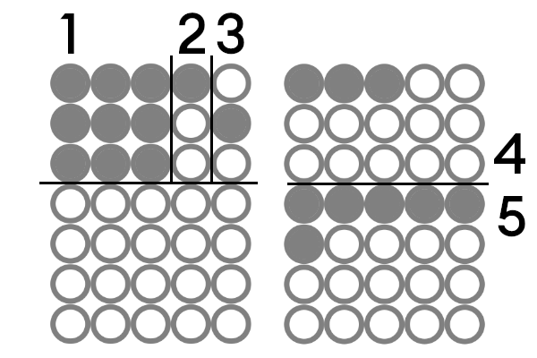
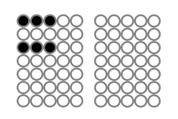
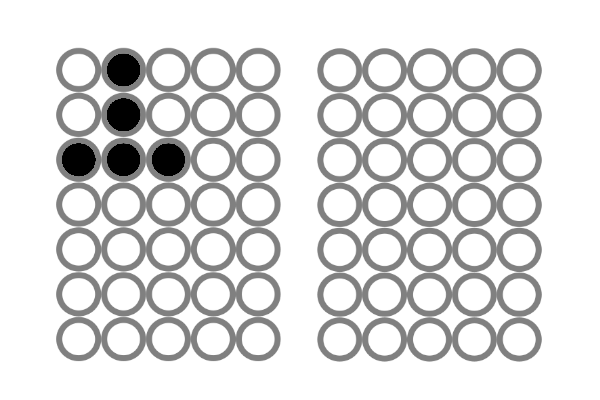

# Alternative Firmware for TSNM MKII by doboz.audio

Minimal eurorack overdubbing sequencer with 3 independent channels. 
Two channels for gates and one channel for envelope from pad pressure value (12 bit). 

One of three channels selectable for 1V/OCT DAC output (16 bit).

Channel One (Gate) -> Max 10 Sequences à 20 Notes

Channel Two (Gate) -> Max 10 Sequences à 20 Notes

Channel Three (Envelope) -> Max 5 Sequences à 5 Notes

[Work in progress]

## Usage

Feed clock input to play/record sequences.

(Feed reset input to retrigger active sequence.)

Place notes by touching the notepad. Timing is not quantized.

### Modes

Long press clickencoder to change active mode (PLAY/RECORD, NOTEEDIT, SAVE)

#### PLAY/RECORD

1: Play/Record
2: Active DAC output channel
3: Selected channel
4/5: Sequences/Notes

While in record mode: Place notes by touching the notepad. Press right button to delete last note.

Rotate clickencoder to select section.

##### Sections

###### 1: Play/Record

Press left button to toggle between play/record.

###### 2: Active DAC output channel

Press left button to select the active DAC output channel.

###### 3: Selected channel

Press left button to select one of the three channels.

###### 4/5: Sequences/Notes

Rotate clickencoder to select sequence slot. 

Press left button to select or create sequence.

Long press right button to delete sequence.

#### NOTEEDIT

Touch notepad and rotate clickencoder to change note value. 

Press left button to save value.

Press right button to toggle clickencoder rotation speed.

#### SAVE

Press right button to save active note values.

Press left button to load saved note values. (saved note values are loaded on start)

--> todo: save sequences

